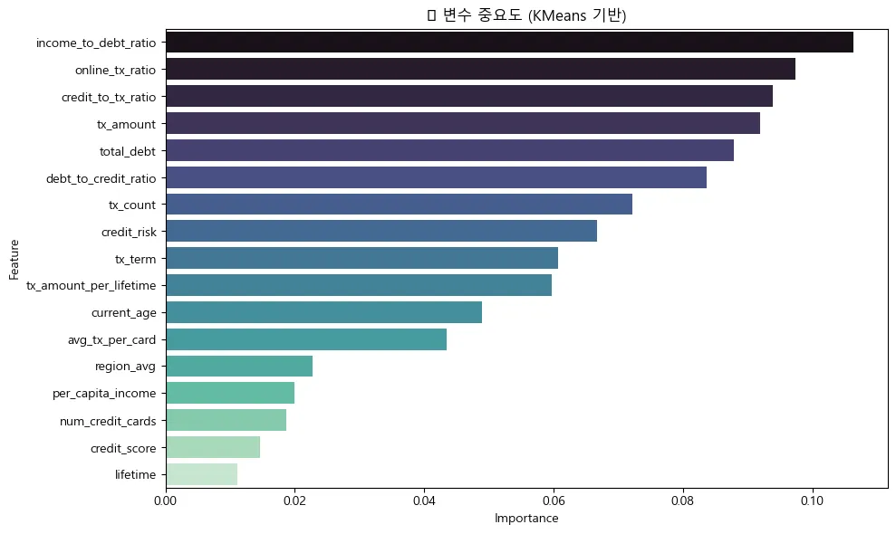
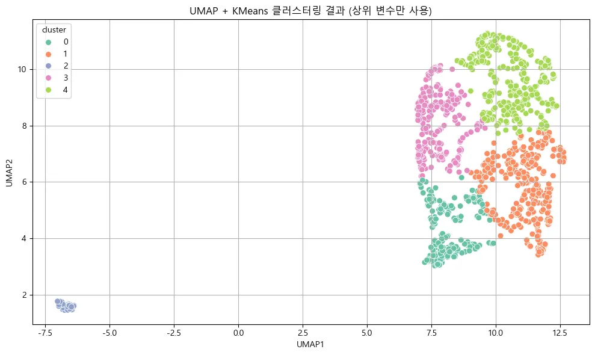
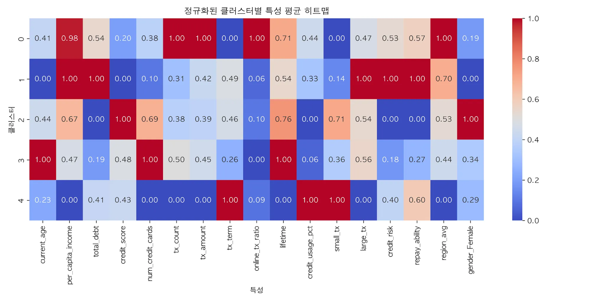
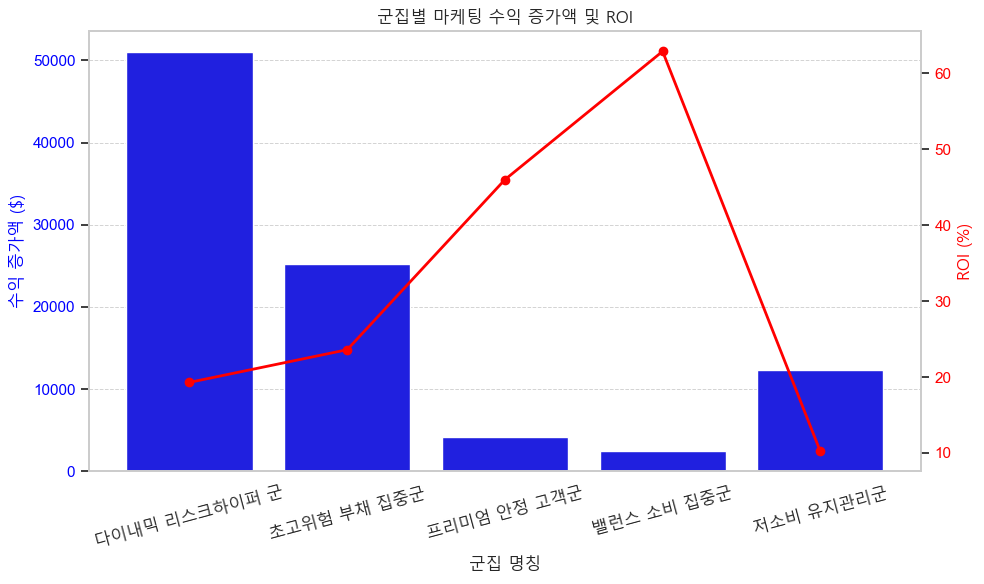

# 🔍 고객 세분화를 통한 수익 모델 최적화 방안 제안

## 📝 개요  
본 프로젝트는 카드사 고객의 거래 데이터를 분석하여 **소비 패턴 기반의 고객 세분화(Clustering)** 를 수행하고, 각 군집별로 **맞춤형 마케팅 전략**을 수립하여 **카드사 수익률 향상**을 도모하는 것을 목표로 합니다. 특히 소비 성향, 부채 규모, 신용 등급 등의 금융 지표를 중심으로 **5개 고객 군집**을 도출하고, 군집별 ROI 기반 마케팅 방안을 제시하였습니다.

## 📌 주요 결과 요약  
- UMAP + KMeans 기반 고객 세분화를 통해 5개 클러스터 도출  
- 각 군집별 특성과 신용/소득/소비 특성의 차이를 반영한 전략 수립  
- ‘초고위험 부채 집중군’에 대한 리스크 관리 전략 및 ‘프리미엄 안정 고객군’에 대한 고급 마케팅 전략 설계  
- 마케팅 실행 시 수익 증가 기대액 **$95,207**, ROI 최대 **+62.9%**, 전체 수익률 **+9.8%p 향상**

## 📁 데이터 소개  
- 출처: Kaggle (익명화된 카드사 거래 데이터셋)  
- 구성: 고객 정보 (2,000명), 거래 데이터 (1,300만 건), 카드 정보 (6,146건), 업종 정보 (MCC 코드)  
- 주요 변수: `per_capita_income`, `credit_score`, `total_debt`, `tx_amount`, `online_tx_ratio` 등  
- 민감 정보는 모두 비식별화 및 범주화 처리

## 🧪 가설 기반 EDA 요약
- 고객의 **거주지에 따른 소비 패턴 차이**를 확인해 지역별 마케팅 전략 수립 가능성을 제시  
- **고소득층**은 **1인당 소비 규모**가 높으며 프리미엄 상품 대상군으로 유효함  
- **소득 수준이 높을수록 소비 카테고리 다양성**이 증가하는 경향 확인  
- **50~60대 연령층의 소비력**이 높아 프리미엄 마케팅 타겟으로 적합  
- **온라인 거래 집중 시간대**를 기반으로 시간대별 프로모션 전략 수립 가능성 탐색  

> ※ 해당 가설들은 텍스트 기반 분석으로만 요약되었으며, 시각화 그래프는 report에 포함되어 있습니다.

## 🛠 기술 스택  
- Python (pandas, numpy, sklearn, umap-learn, seaborn, matplotlib)  
- GeoPandas (위경도 기반 지역군 분석)  
- SQL (대용량 거래데이터 전처리 및 집계)

---

## 📁 폴더 구조

```
customer-segmentation-profit-optimization/
├── data/                  # 샘플 데이터 (실제 데이터는 비공개)
├── images/                # 보고서에 실제 사용된 핵심 그래프(주요 그래프)
├── experiments/           # 탐색적 분석 및 시도된 보조 시각화(보조 그래프)
├── notebooks/             # 분석 노트북 (EDA, Clustering 등)
├── report/                # 최종 결과보고서 (PDF)
├── requirements.txt       # 사용한 라이브러리 목록
├── .gitignore             # Git 무시 설정
└── README.md              # 프로젝트 설명 파일
```

---

## 📎 클러스터링 대표 시각화

  
  
  

